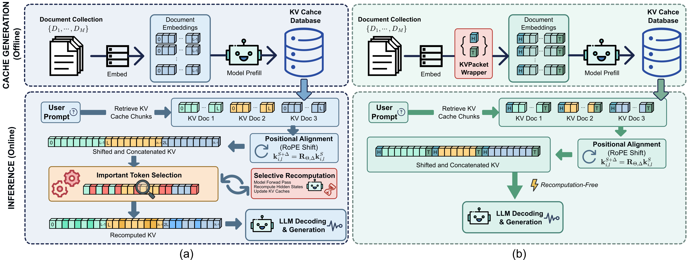
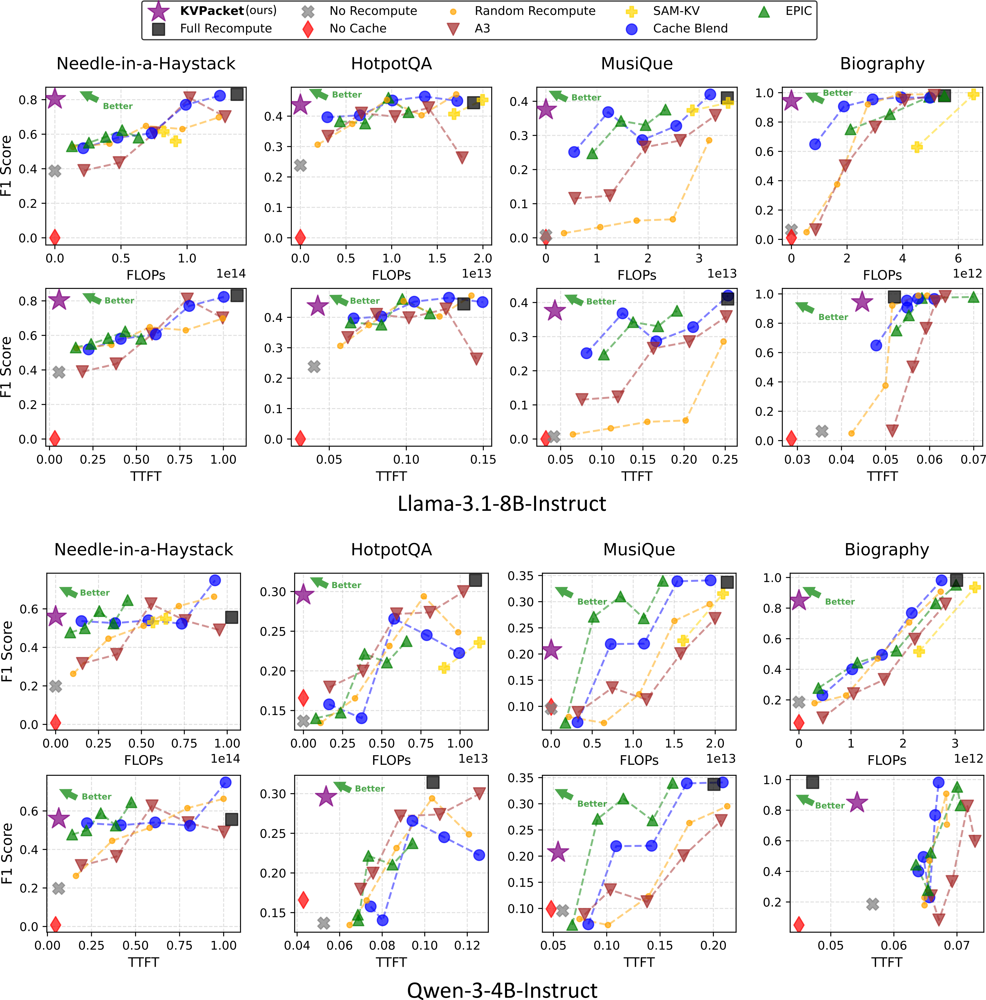

<p align="center">
  <h3 align="center"><strong>KV Packet: Recomputation-Free Context-Independent KV Caching for LLMs </strong></h3>

<p align="center">
    Chuangtao Chen<sup>1</sup>,
    Grace Li Zhang<sup>2</sup>,
    XunZhao Yin<sup>3</sup>,
    Cheng Zhuo<sup>3</sup>,
    Bing Li<sup>4</sup>,
    Ulf Schlichtmann<sup>1</sup><br>
    <sup>1</sup>Technical University of Munich,
    <sup>2</sup>Technical University of Darmstadt<br>
    <sup>3</sup>Zhejiang Univerity,
    <sup>4</sup>Technische Universität Ilmenau
</p>


<div align="center">

<a href='https://arxiv.org/abs/2604.13226'></a> &nbsp;&nbsp;&nbsp;&nbsp;&nbsp;
 <a href='LICENSE'></a> &nbsp;&nbsp;&nbsp;&nbsp;&nbsp;
</div>

<p align="center">
    
    <em><br>(a) Recomputation-based approaches require inference-time algorithms to select and recompute important tokens to repair contextual staleness; (b) the proposed KV Packet approach wraps documents with global adapters.</em>
</p>

<p align="center">
    
    <em><br>Evaluation results (F1 score, FLOPs, Time-to-First-Token) of Llama-3.1-8B / Qwen-3-4B on datasets: Needle-in-a-Haystack, Biography, HotpotQA, and MusiQue.</em>
</p>

# KV Packet

**KV Packet** is a framework for reusing precomputed KV caches across documents in multi-document RAG settings, without recomputation.

## Core Idea

Each document's KV cache is wrapped with a small set of trainable soft-token vectors — a **header** prepended before the document and a **trailer** appended after it. At inference time, independently cached documents are directly concatenated. No recomputation is needed.

**Why it works:** Naive KV cache concatenation fails because of boundary artifacts — disrupted attention sinks and abrupt token distribution shifts at block boundaries. The learned adapter vectors act as smooth delimiters that absorb these artifacts, restoring output quality close to full-attention inference.

**Training:** Adapters are trained via self-supervised KL distillation. The model's own full-attention output serves as the teacher signal, and only the small adapter tensors receive gradients. No labeled data or base model modification is needed.

**Key results:**
- ~4–6 orders of magnitude fewer FLOPs than recomputation-based baselines (CacheBlend, EPIC, A3)
- Lower TTFT than all recomputation methods
- Competitive F1 on retrieval (NIAH, Biography) and reasoning (HotpotQA, MuSiQue) benchmarks
- Naturally compatible with KV compression techniques
- Storage overhead of 0.4%–6% for realistic document lengths (≥512 tokens)

**Models tested:** Llama-3.1-8B-Instruct and Qwen2.5/3.

---

## Project Structure

```
kv_packet_clean/
├── run_train_filler.py         # Phase 1: train header/trailer adapters
├── run_eval.py                 # Phase 2: evaluate on benchmarks
├── run_build_packet.py         # Ablation A.1: initialize wrapper from handcrafted tokens
│
├── kv_packet/                  # Core library
│   ├── packet_wrapper/         # PacketWrapper: header/trailer parameter tensors
│   ├── cache/                  # KV cache storage, quantization, compression, re-rotation
│   ├── cache_comb/             # Cache combination methods (KV Packet + all baselines)
│   ├── dataset/                # Dataset loaders (Biography, HotpotQA, NIAH, MuSiQue)
│   ├── model/                  # Supported model type definitions
│   └── utils/                  # Training loop, generation cache, metrics, config loader
│
├── packet_wrapper_config/      # Training configs organised by model and dataset
├── eval_config/                # Evaluation configs organised by model and dataset
├── ablation_study/             # Ablation experiments (loss type, explicit tokens)
└── plot_scripts/               # Result visualisation
```

---

## Workflow

### Train

Trains the header and trailer adapters on one or more retrieval datasets. Only the wrapper parameters receive gradients; the base model is frozen throughout.

```bash
python run_train_filler.py <config.json> [<config2.json> ...]
# or pass a directory to pick up all configs inside it
python run_train_filler.py packet_wrapper_config/llama_3_1_8b/mixture/
```

Checkpoints can be saved using the config. Training can be resumed from a checkpoint by setting `resume: true` in the config.

### Evaluate

Runs one or more evaluation configs and writes results as JSON files alongside each config.

```bash
python run_eval.py <config.json or directory> [--overwrite] [--debug]
```

`--overwrite` re-runs configs that already have a result file. `--debug` disables the progress bar.

Results are written to `eval_results/<config_name>_result.json` next to each config file.

### Setup

Before running training or evaluation, update the `model.model_path` field in all config files to point to your local model directory or a HuggingFace model identifier. The default paths in the example configs may not exist on your system.


---

## Training Configuration Reference

See [res/train_config.md](./res/train_config.md) for the full field reference, sub-block descriptions, and an example config.

---

## Evaluation Configuration Reference

See [res/eval_config.md](./res/eval_config.md) for the full field reference, all available cache combination methods with their kwargs, compress/quantization blocks, and example configs.

---

## Config Inheritance

Both training and evaluation configs support a `_default.json` file in the same directory. When a config is loaded, its values extend (but do not overwrite) the defaults. This means a per-method override file only needs to list the fields that differ.

Fields present only in the override are added. Fields present in both default and override are kept from the **default** unless `broadcast_dict` is called in overwrite mode. Cycle detection prevents circular inheritance.

---

## Evaluation Metrics

Each evaluation run reports the following per-config:

| Metric | Description |
|--------|-------------|
| `precision` | Token-level precision of the generated answer vs. the ground-truth answer. |
| `recall` | Token-level recall. |
| `f1` | Harmonic mean of precision and recall. Primary benchmark metric. |
| `ttft` | Average time-to-first-token in seconds across samples. |
| `flops` | Average FLOPs for KV re-rotation (relevant to KV Packet; zero for non-rotation methods). |
| `num_orig_tokens` | Total original document tokens processed (before wrapping). |
| `num_wrapped_tokens` | Total tokens after adding header and trailer padding. |

---

## Supported Models

| Model | Template key |
|-------|-------------|
| Llama-3.1-8B-Instruct | `"llama_chat"` |
| Qwen2.5 / Qwen3-4B | `"qwen_3_chat"` |

Adding a new model requires implementing a model-specific KV re-rotation in `kv_packet/cache_comb/recompute_kv/` and registering it in `kv_packet/model/`.


## Citation

To cite our work:
```
@misc{
    chen2026kvpacket,
    title={KV Packet: Recomputation-Free Context-Independent KV Caching for LLMs}, 
    author={Chuangtao Chen and Grace Li Zhang and Xunzhao Yin and Cheng Zhuo and Bing Li and Ulf Schlichtmann},
    year={2026},
    eprint={2604.13226},
    archivePrefix={arXiv},
    primaryClass={cs.LG},
    url={https://arxiv.org/abs/2604.13226},
}
```